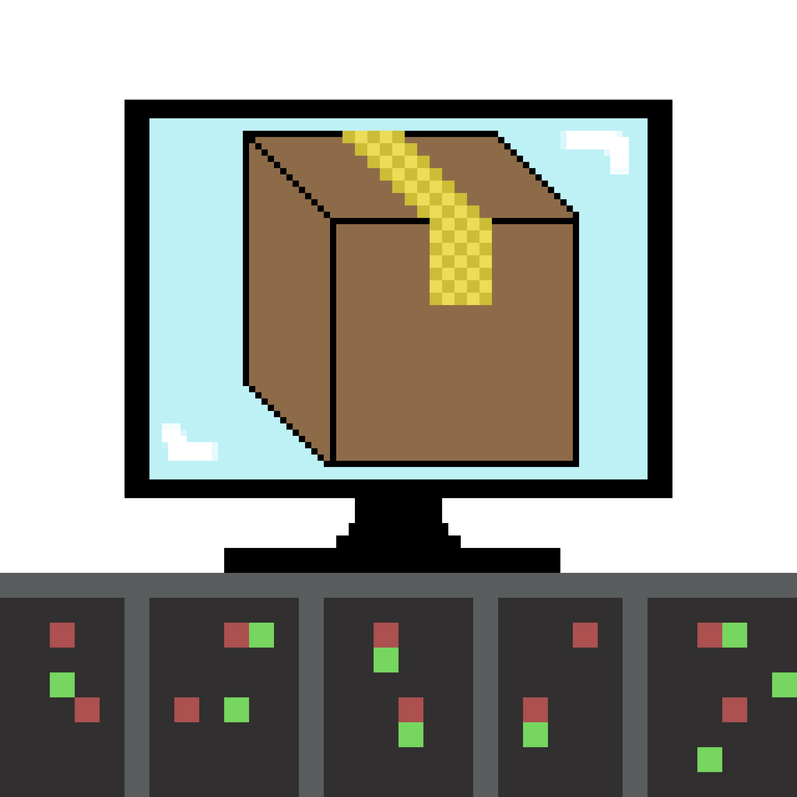

# FileTransferGo



## Packages used 📦

* Go:
  * Gin (*http server*) 🌐
  * Cobra (*CLI command framework*) 🐍
* External :
  * Ngrok (*secure tunnels*) 🔒

## Features 

* 👥 Client
  * Send Files to another computer using command line
  
* 💻 Server
  * Listen for files from other computers across the internet using Ngrok secure tunnels
  
*  🔖 On every subcommand there is -h flag to show description of all commands
  
## 📚 How to use

*[Get yout Ngrok Authtoken](https://dashboard.ngrok.com/get-started/your-authtoken "Go to Ngrok")*

1. Set authtoken if u haven't use ngrok **```$ ngrok authtoken <authtoken> ```**  (run it on project folder)

2. Run CLI from Go **```$ go run . <Commands>```** 

- - - -

### Windows

2. Run CLI from file **```$ FileTransfer <Commands>```**  (If u did the build)

### Linux

2. Run CLI from file **```$ ./FileTransfer <Commands>```**  (If u did the build)

## 👷‍♂️ Build for your OS

### Linux 

*[Get yout Ngrok Version](https://ngrok.com/download "Go to Ngrok")*

#### **Change the Ngrok.exe with your respective ngrok version on the same path**

- - - -

**```$ go build```** (on project directory)

## 💬 Commands

To see all commands run :

From Go **```$ go run .```** 

- - - -

### If u did the build:

#### Windows

**```$ FileTransfer```**

#### Linux

**```$ ./FileTransfer```**


